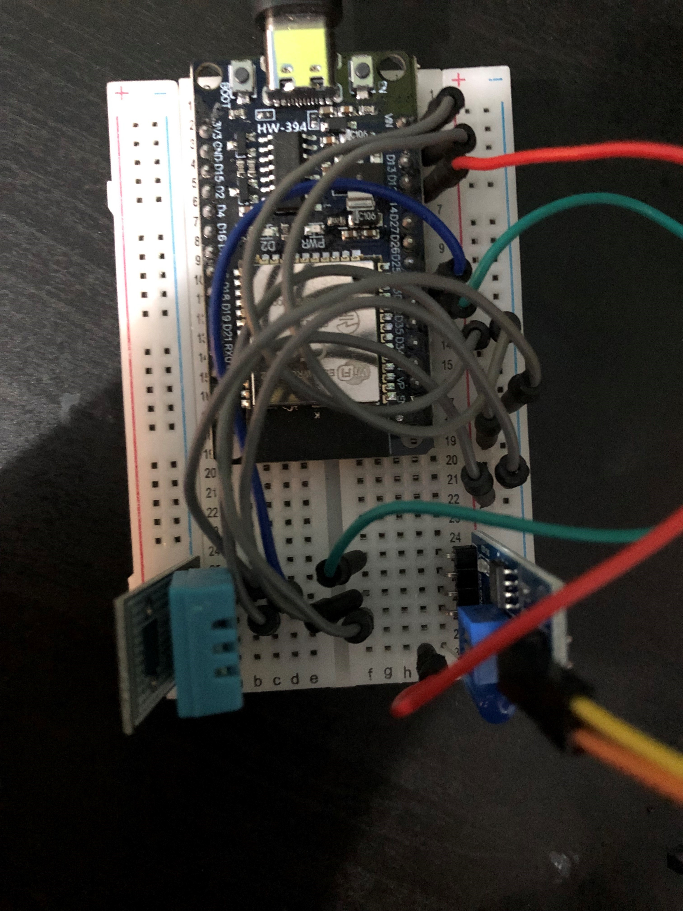

# IoT Project Devleopment Assignment 2023

### Table of Contents

 - Project Overview
 - Project Purpose
 - Goals
 - Development Roadmap
 - Setup Information
 - Sensor Specs
 - Screenshots and other info
 - Refrences/Citations

### Project Overview
This project is and IoT devlopment project in which I will construct a simple weather station using node js. The Weather station will use a DHT11 and Raindrops module, and will be capable of measuring termpearture, humidity and weather it is raining. The station will send to a front end webpage and will also include a tranducer output in the form of an LED.

### Project Purpose
The purpose of the project, which is an assignment for a school IoT Course, will be to get a basic reading of the temperature in an area and output that to a front-end webpage

### Goals
- Include 2 working sensors - DHT11 and Raindrops Module
- Create and engaging front-end webpage with Temp, Humidity and Rain information
- Use graphics to convey weather it is raining or not - in the form of raincloud images
- Include a tranducer output to identify when the Raindrops module senses water

### Development Roadmap

- [x] Setup repos - GitHub
- [x] setup ESP32 - Arduino IDE
- [x] Install dependencies - aREST.h and DHT.h
- [x] Test ESP32 - get json data via wifi
- [x] Initialize Node.js environment
- [x] setup server.js with express
- [X] setup DHT11 and Raindrops Module
- [X] Get all data on front-end webpage
- [X] Design webpage using ejs and css
- [X] Final commits and readme completion

### Setup Information
The weather station will be set up using an esp32 and sensors DHT11 and esp32 Raindrops Module. It will use the analog output from the Raindrops module. All interactions with the esp32 will be coded in Aurduino IDE and written in C++, while front end devlopement will be done in VS Code and will be written in Javascript, EJS and CSS. 

### Screenshots & Wiring
Wiring: 

Coloured wires are used for information sending. Green wire collects anolog outputs from the Raindrops module and is connected to GPIO pin 32. The DHT11 and blue wire are connected to GPIO pin 33. The tranducer output LED is connected to GPIO pin 12. All grey wires are used for power.

Website screenshots:

### Worklog and Commits

Date | Commit Message | Version
:-----|:----------------:|:--------:
25.08.23 | initial setup | 0.1.0

### References

- [Web Page Layouts](https://www.youtube.com/watch?v=3C_22eBWpjg)
- [JS Native Fetch](https://www.youtube.com/watch?v=MBqS1kYzwTc)

